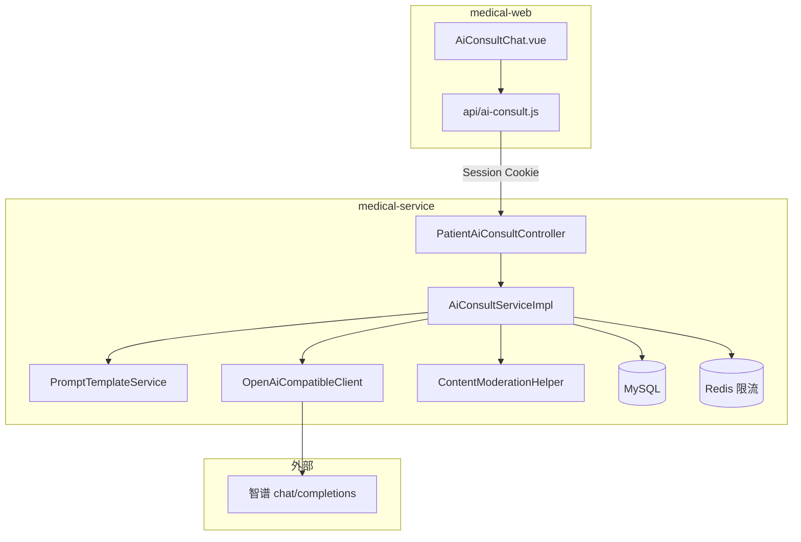
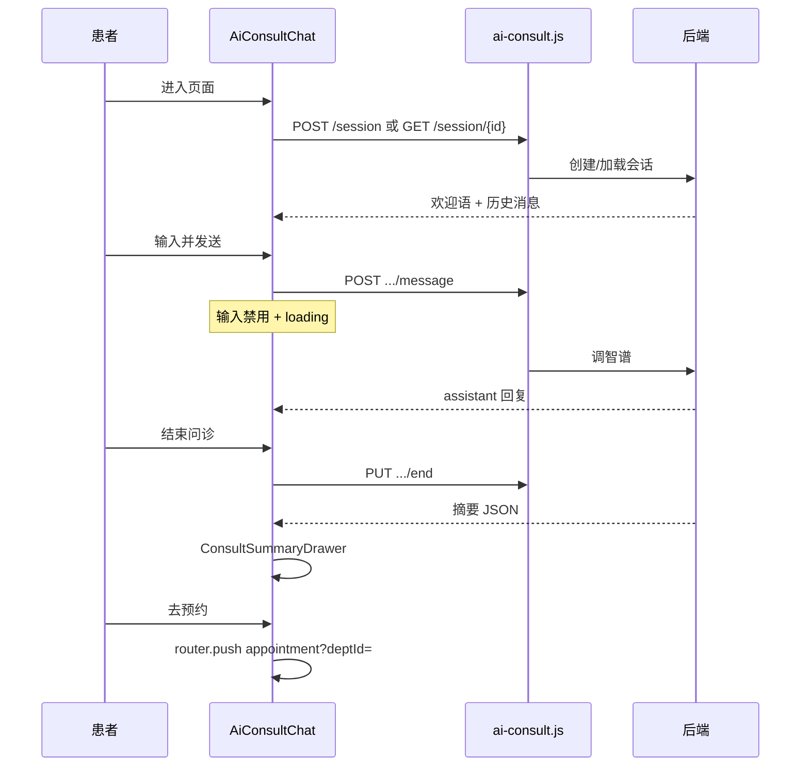
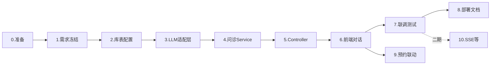

# 阶段 E：AI 智能问诊对话（智谱 AI 接入）— 详细实现流程

> **文档版本**：2026-05-28  
> **适用范围**：`smartMedicalSystem` 全栈（`medical-service` + `medical-web`）  
> **目标厂商**：智谱 AI（OpenAI 兼容接口）  
> **预计工期**：8–12 个工作日（1 人全栈，前后端部分可并行）  
> **关联文档**：`智能医疗服务管理系统后续开发计划.md` 第九章  

---

## 一、文档说明

本文档在《后续开发计划》第九章基础上，**结合当前仓库真实结构**（Session 登录、患者端 Controller 模式、Redis 已依赖未使用、`v16` 脚本尚未创建等），拆成 **10 个可独立验收的步骤**。  

你后续可以按步骤对我说：「做步骤 3」「继续步骤 6」，我会严格按本文档执行。

### 1.1 安全提醒（必读）

你在对话中提供的 API Key **已暴露**，建议在 [智谱开放平台](https://open.bigmodel.cn/) **立即轮换密钥**，并：

| 规则 | 说明 |
|------|------|
| **禁止** | 将 Key 写入 Git、提交到 `application-dev.yml`、写进前端代码 |
| **推荐** | 使用环境变量 `ZHIPU_API_KEY` 或本地 `application-local.yml`（加入 `.gitignore`） |
| **本文档** | 仅使用 `${ZHIPU_API_KEY}` 占位，不包含真实密钥 |

---

## 二、功能范围与边界

### 2.1 一期要做

| 能力 | 说明 |
|------|------|
| 患者多轮对话 | 登录后 `PATIENT` 角色使用智能问诊页 |
| 会话持久化 | `ai_consult_session` + `ai_consult_message` |
| 历史会话 | 列表、进入继续聊（仅进行中）或只读查看 |
| 结束问诊 + 摘要 | 调用模型生成 JSON 摘要，展示主诉/建议科室/就医建议 |
| 急症关键词 | 本地规则优先，不调模型或叠加急诊模板 |
| 限流 | Redis 按用户每日请求次数（依赖已引入的 `spring-boot-starter-data-redis`） |
| 后端代理 LLM | 浏览器 **不得** 直连智谱 API |
| 降级开关 | `medical.ai.enabled=false` 时返回 Mock，便于答辩无网 |

### 2.2 一期不做（二期 backlog）

- SSE 流式打字机（`/message/stream`）
- 医生端只读预问诊摘要
- 语音输入、图片多模态
- RAG 医院知识库
- 管理端 Token 审计报表
- 与 `MedicalRecordList` 的「AI 病历建议」共用（阶段 D4，可复用 `LlmClient` 但业务分开）

### 2.3 合规文案（前端常驻）

> 本服务由人工智能提供健康咨询参考，不能替代执业医师面诊。如有胸痛、呼吸困难、大出血、意识不清等紧急情况，请立即拨打 120 或前往急诊科。

首条 `system` 消息或页面 `ConsultDisclaimer.vue` 中必须展示。

---

## 三、智谱 AI 接入参数（已定选型）

### 3.1 OpenAI 兼容端点

| 配置项 | 推荐值 |
|--------|--------|
| `medical.ai.provider` | `zhipu` |
| `medical.ai.base-url` | `https://open.bigmodel.cn/api/paas/v4/` |
| `medical.ai.model` | **`glm-4-flash`**（成本低、响应快，适合课程/demo；可按账号权限改为 `glm-4-plus`） |
| 鉴权 Header | `Authorization: Bearer ${ZHIPU_API_KEY}` |
| 调用路径 | `POST {base-url}chat/completions` |

官方说明：[OpenAI API 兼容 - 智谱AI](https://docs.bigmodel.cn/cn/guide/develop/openai/introduction)

### 3.2 开发环境连通性自测（步骤 1 完成标准）

在配置好环境变量后，用 curl 验证（**不要在仓库保存 Key**）：

```bash
curl -s https://open.bigmodel.cn/api/paas/v4/chat/completions \
  -H "Authorization: Bearer %ZHIPU_API_KEY%" \
  -H "Content-Type: application/json" \
  -d "{\"model\":\"glm-4-flash\",\"messages\":[{\"role\":\"user\",\"content\":\"你好，请用一句话介绍你自己\"}],\"max_tokens\":100}"
```

期望：HTTP 200，响应体含 `choices[0].message.content`。

### 3.3 后端配置草案（步骤 2 写入，Key 走环境变量）

```yaml
# application-dev.yml 或 application-local.yml（local 不入库）
medical:
  ai:
    enabled: true
    provider: zhipu
    base-url: https://open.bigmodel.cn/api/paas/v4/
    api-key: ${ZHIPU_API_KEY:}
    model: glm-4-flash
    timeout-ms: 60000
    max-context-messages: 20      # 带入模型的历史条数上限（user+assistant 对）
    max-output-tokens: 1024
    temperature: 0.5
    daily-request-limit-per-user: 50
    max-user-message-length: 2000
    mock-reply-enabled: true      # enabled=false 时走 Mock
```

---

## 四、总体架构



**与现有系统对齐点：**

| 项目 | 现状 | 阶段 E 用法 |
|------|------|-------------|
| 认证 | HttpSession + Cookie | 沿用，`withCredentials: true` |
| 患者 ID | 各 Controller 内 `getCurrentPatientId()` | 复用 `PatientMedicalRecordController` 同款逻辑，后期可抽 `PatientContextService` |
| 权限 | `SecurityConfig`：`/api/patient/**` → `PATIENT` 等 | **无需** 新增 Security 规则 |
| 前端路由权限 | `route-permissions.js`：`/patient/` 含 PATIENT | 新增 `/patient/ai-consult` 自动继承 |
| Redis | `application-dev.yml` 已配，**无业务代码** | 本阶段首次实现 `RedisTemplate` 限流 |
| DB 脚本 | 最新 `v14_medicine_stock_log.sql` | 新增 **`v16_ai_consult_tables.sql`** |

---

## 五、数据库设计

**脚本路径**：`medical-service/src/main/resources/db/v16_ai_consult_tables.sql`

### 5.1 表 `ai_consult_session`

| 字段 | 类型 | 说明 |
|------|------|------|
| session_id | BIGINT PK AUTO_INCREMENT | 会话 ID |
| session_no | VARCHAR(50) UNIQUE | 如 `C202605281430001234` |
| patient_id | BIGINT NOT NULL | 患者 ID |
| title | VARCHAR(200) | 首条用户消息截断或 AI 标题 |
| status | TINYINT DEFAULT 1 | 1=进行中 2=已结束 3=已转预约 |
| chief_complaint | VARCHAR(500) | 结构化主诉 |
| suggested_dept_id | BIGINT | 建议科室，关联 `sys_dept` |
| urgency_level | VARCHAR(20) | NORMAL / URGENT / EMERGENCY |
| summary | TEXT | JSON 或 Markdown 全文摘要 |
| message_count | INT DEFAULT 0 | 消息条数 |
| token_used | INT DEFAULT 0 | 累计 token（统计用） |
| deleted | TINYINT DEFAULT 0 | 软删（可选，一期建议加上） |
| created_time | DATETIME | |
| updated_time | DATETIME | |
| ended_time | DATETIME | 结束时间 |

**索引**：`idx_session_patient (patient_id, created_time DESC)`、`uk_session_no`

### 5.2 表 `ai_consult_message`

| 字段 | 类型 | 说明 |
|------|------|------|
| message_id | BIGINT PK AUTO_INCREMENT | |
| session_id | BIGINT NOT NULL | |
| role | VARCHAR(20) | system / user / assistant |
| content | TEXT NOT NULL | |
| content_type | VARCHAR(20) DEFAULT 'TEXT' | 预留 IMAGE |
| model_name | VARCHAR(50) | 实际模型名 |
| prompt_tokens | INT | 可选 |
| completion_tokens | INT | 可选 |
| created_time | DATETIME | |

**索引**：`idx_message_session_time (session_id, created_time)`

### 5.3 可选表 `ai_consult_session_appointment`（二期）

关联 `session_id` 与 `appointment_id`，用于「结束问诊 → 一键预约」埋点。一期可用 `status=3` + 前端 query 传参代替。

---

## 六、REST API 设计

**前缀**：`/api/patient/ai-consult`  
**权限**：与现有患者端一致（`hasAnyRole("PATIENT", "DOCTOR", "RECEPTIONIST")`，实际使用账号应为 **PATIENT**）

| 方法 | 路径 | 说明 | 一期 |
|------|------|------|------|
| POST | `/session` | 创建会话，返回 sessionId、welcomeMessage | ✅ |
| GET | `/session/list` | 我的历史会话（分页：pageNum, pageSize） | ✅ |
| GET | `/session/{sessionId}` | 会话详情 + 消息列表 | ✅ |
| POST | `/session/{sessionId}/message` | 发送用户消息，同步返回 AI 回复 | ✅ |
| POST | `/session/{sessionId}/message/stream` | SSE 流式 | ❌ 二期 |
| PUT | `/session/{sessionId}/end` | 结束会话并生成摘要 | ✅ |
| GET | `/session/{sessionId}/summary` | 获取摘要（已结束会话） | ✅ |
| DELETE | `/session/{sessionId}` | 软删会话 | ✅ 可选 |
| GET | `/dept/suggest` | 根据关键词匹配科室 | ✅ 规则为主 |

### 6.1 请求/响应约定（与项目 `ResultVo` 一致）

**创建会话响应 `data`：**

```json
{
  "sessionId": 1,
  "sessionNo": "C202605281430001234",
  "welcomeMessage": "您好，我是智能问诊助手…",
  "disclaimer": "本服务由人工智能提供…"
}
```

**发送消息请求：**

```json
{ "content": "我头痛三天了，伴有低烧" }
```

**发送消息响应 `data`：**

```json
{
  "userMessageId": 101,
  "assistantMessageId": 102,
  "reply": "了解您头痛伴低烧已三天。请问…",
  "urgencyHint": null
}
```

急症时 `urgencyHint` 可为 `"EMERGENCY"`，前端气泡高亮。

### 6.2 业务校验规则（Service 层统一）

| 场景 | 处理 |
|------|------|
| session 不属于当前 patientId | `BusinessWarningException("无权访问该会话")` |
| status ≠ 进行中 仍发消息 | 提示「会话已结束，请新建会话」 |
| content 为空或超长 | 校验 `@NotBlank` + 截断至 2000 字 |
| 每日限流超限 | `BusinessWarningException("今日智能问诊次数已达上限")` |
| `medical.ai.enabled=false` | 返回预设 Mock 回复，不写真实 token |
| 智谱 401/超时 | 全局异常 → 「智能服务暂时不可用，请稍后重试」 |

---

## 七、后端模块与文件清单

```
medical-service/src/main/java/com/medical/
├── ai/
│   ├── config/
│   │   ├── AiProperties.java              # @ConfigurationProperties(prefix="medical.ai")
│   │   └── AiAutoConfiguration.java       # 条件装配 LlmClient、enabled 开关
│   ├── client/
│   │   ├── LlmClient.java
│   │   ├── OpenAiCompatibleClient.java    # RestClient 调用 chat/completions
│   │   └── dto/
│   │       ├── LlmChatMessage.java
│   │       ├── LlmChatRequest.java
│   │       └── LlmChatResponse.java
│   ├── prompt/
│   │   └── PromptTemplateService.java
│   └── support/
│       ├── ContentModerationHelper.java
│       └── AiRateLimitService.java        # Redis INCR
├── domain/
│   ├── entity/AiConsultSession.java
│   ├── entity/AiConsultMessage.java
│   ├── dto/AiConsultMessageSendDto.java
│   └── vo/
│       ├── AiConsultSessionVo.java
│       ├── AiConsultMessageVo.java
│       └── AiConsultSummaryVo.java
├── mapper/
│   ├── AiConsultSessionMapper.java
│   └── AiConsultMessageMapper.java
├── service/
│   ├── AiConsultService.java
│   └── impl/AiConsultServiceImpl.java
└── web/api/patient/
    └── PatientAiConsultController.java

medical-service/src/main/resources/db/
└── v16_ai_consult_tables.sql
```

**可选重构（非必须）**：将 `getCurrentPatientId()` 抽到 `com.medical.service.PatientContextService`，供病历、处方、问诊共用。

---

## 八、Prompt 设计要点

### 8.1 对话 System Prompt（存入 `PromptTemplateService`）

需包含：

1. **角色**：某医院线上预问诊助手，中文、简短、有同理心。  
2. **任务**：追问主诉、起病时间、程度、诱因、伴随症状；可问过敏史/既往史（自愿）。  
3. **约束**：  
   - 单次回复 ≤ 150 字（可配置）；  
   - **禁止**「您得了 XXX 病」式确诊；  
   - 可说「建议到 XX 科室」「建议尽快就医」；  
   - 注入本院科室列表：`dept_id` + `dept_name`（启动时或首次会话从 `sys_dept` 查询缓存）。  
4. **急症**：若用户描述胸痛、昏迷、大出血等，首句必须提醒 120/急诊（与 `ContentModerationHelper` 双保险）。

### 8.2 结束会话 — 摘要 Prompt（单独一次 LLM 调用）

```
请根据以下医患对话，仅输出 JSON，不要 markdown 代码块：
{
  "chief_complaint": "",
  "urgency_level": "NORMAL|URGENT|EMERGENCY",
  "suggested_dept_name": "",
  "medical_advice": "",
  "questions_for_doctor": []
}
```

后端解析 JSON → 写入 `chief_complaint`、`urgency_level`、`summary`；`suggested_dept_name` 与 `sys_dept` **模糊匹配** 得到 `suggested_dept_id`。

解析失败时：整段文本存入 `summary`，`urgency_level=NORMAL`，不阻塞结束流程。

---

## 九、前端模块与文件清单

```
medical-web/src/
├── api/ai-consult.js
├── views/patient/AiConsultChat.vue
└── components/ai/
    ├── ChatMessageList.vue
    ├── ChatInputBar.vue
    ├── ConsultDisclaimer.vue
    └── ConsultSummaryDrawer.vue
```

### 9.1 路由与菜单

| 项 | 值 |
|----|-----|
| 路由 path | `patient/ai-consult`（完整 URL：`/patient/ai-consult`） |
| 组件 | `AiConsultChat.vue` |
| meta.title | `智能问诊` |
| 菜单 | `menu-config.js` → `patientMenuItems` 增加分组「智能服务」→「智能问诊」 |

**修改文件：**

- `medical-web/src/router/index.js` — 注册路由  
- `medical-web/src/config/menu-config.js` — 菜单项  

### 9.2 页面交互流程



### 9.3 API 封装与超时

现有 `request.js` 默认 `timeout: 10000`，**AI 接口会超时**。

**做法（步骤 6）**：在 `ai-consult.js` 中单独创建 axios 实例，或单次请求覆盖：

```javascript
// 示例：仅 ai-consult 使用 60s
timeout: 60000
```

### 9.4 「去预约」联动

跳转：`/patient/appointment?deptId={suggestedDeptId}`  

在 `AppointmentBooking.vue` 的 `onMounted` 中读取 `route.query.deptId`，若存在则预选科室（与后续开发计划 9.10 一致，可在步骤 6 或步骤 9 完成）。

---

## 十、分步实施流程（执行顺序）

以下 **10 步** 对应你说「做步骤 N」时的粒度。每步含：**任务清单、涉及文件、检查点、风险**。

---

### 步骤 0：开工前准备（0.5 天，可与步骤 1 合并）

| # | 任务 |
|---|------|
| 0.1 | 在智谱平台确认账号余额、模型 `glm-4-flash` 有权限 |
| 0.2 | **轮换**已泄露的 API Key，新 Key 仅放本机环境变量 |
| 0.3 | 确认 MySQL、Redis 本地可连（`application-dev.yml` 已有 Redis 配置） |
| 0.4 | 准备 1 个患者测试账号（`PATIENT` 角色） |

**检查点**：curl 调通智谱；患者账号能登录前端。

---

### 步骤 1：需求冻结与接口形态确认（0.5 天）

| # | 任务 |
|---|------|
| 1.1 | 确认一期：**同步 JSON**，不做 SSE |
| 1.2 | 确认演示脚本：3 轮对话 → 结束 → 看摘要 → 去预约 |
| 1.3 | 与指导老师确认「非诊断」边界（答辩话术） |

**产出**：本步骤无代码；更新 mentally 的验收清单（见第十二章）。

**检查点**：各方对「不做确诊、不开处方」无异议。

---

### 步骤 2：数据库 + 配置骨架（0.5 天）

| # | 任务 |
|---|------|
| 2.1 | 编写 `v16_ai_consult_tables.sql` 并在本地库执行 |
| 2.2 | 新增 `AiConsultSession`、`AiConsultMessage` 实体与 Mapper |
| 2.3 | 新增 `AiProperties` + `application-dev.yml` 中 `medical.ai.*`（**api-key 用占位符**） |
| 2.4 | 新建 `application-local.yml.example` 说明如何配置 `ZHIPU_API_KEY` |
| 2.5 | 确认 `.gitignore` 忽略 `application-local.yml` |

**检查点**：表存在；启动应用无报错；`AiProperties` 能读到配置。

---

### 步骤 3：LLM 适配层（1–1.5 天）

| # | 任务 |
|---|------|
| 3.1 | `LlmClient` 接口 + `OpenAiCompatibleClient`（`RestClient` 或 `RestTemplate`） |
| 3.2 | 组装请求：`model`、`messages`、`max_tokens`、`temperature` |
| 3.3 | 解析响应：`choices[0].message.content`，记录 `usage`（可选） |
| 3.4 | 异常：`LlmApiException`、`LlmTimeoutException` → `GlobalExceptionHandler` 友好文案 |
| 3.5 | `ContentModerationHelper`：急症关键词表 → 返回固定急诊模板 |
| 3.6 | `medical.ai.enabled=false` 时 `MockLlmClient` 或 Client 内分支 |
| 3.7 | 单元测试：Mock HTTP 或 `@Disabled` 集成测试 |

**检查点**：写一个临时 `@SpringBootTest` 或 CommandLineRunner 能打印模型回复；401/超时错误信息明确。

**智谱请求体示例（实现参考）：**

```json
{
  "model": "glm-4-flash",
  "messages": [
    { "role": "system", "content": "你是..." },
    { "role": "user", "content": "我咳嗽两天" }
  ],
  "max_tokens": 1024,
  "temperature": 0.5
}
```

---

### 步骤 4：问诊业务 Service（2 天）

| # | 任务 | 方法 |
|---|------|------|
| 4.1 | 创建会话 | `createSession(patientId)`：insert session；insert system 消息；返回欢迎语 |
| 4.2 | 发送消息 | `sendMessage(sessionId, patientId, content)`：校验 → user 消息 → 组装 history → 急症检测 → `LlmClient.chat` → assistant 消息 → 更新 count/token |
| 4.3 | 结束会话 | `endSession(...)`：摘要 Prompt → 解析 JSON → 更新 session status=2 |
| 4.4 | 查询 | `listSessions`、`getSessionDetail`、`getSummary` |
| 4.5 | 删除 | 软删 `deleted=1`（可选） |
| 4.6 | 限流 | `AiRateLimitService`：`INCR ai:limit:{userId}:{yyyyMMdd}`，TTL 25h |
| 4.7 | 科室匹配 | `suggested_dept_name` 与 `sys_dept.dept_name` 模糊匹配 |

**历史消息组装逻辑：**

1. 查询该 `session_id` 下按 `created_time` 排序的消息；  
2. 保留首条 `system` + 最近 N 条 user/assistant（N = `max-context-messages`）；  
3. 映射为智谱 `messages` 数组。

**检查点**：Postman / Apifox 跑通：**建会话 → 3 轮 message → end → summary**。

---

### 步骤 5：REST Controller + 文档（0.5 天）

| # | 任务 |
|---|------|
| 5.1 | `PatientAiConsultController` 映射第六章全部一期接口 |
| 5.2 | 每个接口调用 `getCurrentPatientId()`（复制患者病历 Controller 模式即可） |
| 5.3 | DTO 校验：`@Valid`、`@NotBlank` |
| 5.4 | Knife4j `@Tag`、`@Operation` 补充说明 |

**检查点**：患者 Cookie 可访问；换医生账号访问他人 `sessionId` 返回业务错误/403。

---

### 步骤 6：前端对话窗口（2–3 天）

| # | 任务 |
|---|------|
| 6.1 | `api/ai-consult.js` 封装全部接口，**timeout 60s** |
| 6.2 | 子组件：免责声明、消息列表、输入栏、摘要抽屉 |
| 6.3 | `AiConsultChat.vue`：进入页 `createSession`；支持 `?sessionId=` 拉历史 |
| 6.4 | 发送：loading、「正在输入…」、滚动到底 |
| 6.5 | 结束问诊 → 抽屉展示摘要 |
| 6.6 | 「去预约」带 `deptId` query |
| 6.7 | 路由 + 菜单注册 |
| 6.8 | 样式对齐 Element Plus + 现有患者页 |

**检查点**：浏览器完整演示；刷新后历史消息仍在；Network 面板 **无** 智谱域名、无 Key。

---

### 步骤 7：联调与安全加固（1–1.5 天）

| 测试类型 | 用例 |
|----------|------|
| 功能 | 新建 / 列表 / 发送 / 结束 / 摘要 / 删除 |
| 权限 | 患者 A 不能访问 B 的 sessionId |
| 边界 | 空消息、超长、已结束仍发送 |
| 急症 | 输入「胸痛」→ 含 120/急诊引导 |
| 限流 | 超限提示明确 |
| 异常 | 错误 Key、断网、超时 |
| 日志 | INFO 不打印完整对话，仅 sessionId + token 统计 |
| 降级 | `enabled=false` 仍可演示 |

**检查点**：自测表全部打勾；录屏 3–5 分钟。

---

### 步骤 8：部署与运维说明（0.5 天）

| # | 任务 |
|---|------|
| 8.1 | 生产环境变量：`ZHIPU_API_KEY`、`medical.ai.*` |
| 8.2 | 若二期 SSE：Nginx `proxy_buffering off`（一期可跳过） |
| 8.3 | 回写 `智能医疗服务管理系统项目文档4.25.md`（患者端模块 + API 表） |

---

### 步骤 9：预约联动增强（0.5 天，可与步骤 6 并行）

| # | 任务 |
|---|------|
| 9.1 | `AppointmentBooking.vue` 支持 `?deptId=` 预选 |
| 9.2 | 摘要页「去预约」按钮传参 |

---

### 步骤 10：二期预留（不纳入一期工期）

| 功能 | 说明 |
|------|------|
| SSE | `POST .../message/stream` + 前端 `fetch` stream |
| 医生只读摘要 | 待诊队列展示 `ai_consult_session.summary` |
| 病历导入 | 医生写病历导入预问诊摘要 |
| D4 共用 | `LlmClient` + `ai_suggestion` 表 |

---

## 十一、开发流程总览



**建议并行：**

- 步骤 3 完成后，步骤 4 与步骤 6 的 **静态页面/mock** 可并行；  
- 步骤 5 完成后前端才对接真实 API。

---

## 十二、阶段 E 验收标准（答辩用）

1. 患者登录 →「智能问诊」→ **≥3 轮**有效对话。  
2. 浏览器 Network **看不到**智谱 API Key 及 `open.bigmodel.cn` 请求（仅本站 `/api/patient/ai-consult`）。  
3. 结束问诊后展示结构化摘要（主诉、建议科室、就医建议）。  
4. 急症关键词触发急诊引导（**不依赖**模型幻觉）。  
5. 历史会话可查看；**无法**访问他人 `sessionId`。  
6. （可选）摘要页「去预约」科室预填正确。  
7. `medical.ai.enabled=false` 时可 Mock 演示，不影响其他模块。

---

## 十三、常见问题与排错

| 现象 | 可能原因 | 处理 |
|------|----------|------|
| 401 from 智谱 | Key 错误或未配置环境变量 | 检查 `ZHIPU_API_KEY`、是否轮换后未更新 |
| 前端 10s 超时 | 默认 axios timeout | ai-consult 单独 60s |
| 403 患者接口 | 未登录或非 PATIENT | 用患者账号登录 |
| Redis 连接失败 | 本地未启 Redis | 启动 Redis 或步骤 4 限流改内存版（仅 dev） |
| 摘要 JSON 解析失败 | 模型输出带 markdown | 清洗 `` ```json `` 后再 `ObjectMapper` |
| 科室匹配不到 | 名称不一致 | 维护别名表或 LLM 返回 dept_id（二期） |

---

## 十四、与你协作的推荐口令

后续你可以直接说：

- 「执行 **步骤 2**：数据库和配置」  
- 「执行 **步骤 3–5**：后端全部」  
- 「执行 **步骤 6**：前端智能问诊页」  
- 「执行 **步骤 7**：联调并修 bug」  

我会按本章顺序实施，并在每步结束汇报 **检查点** 是否满足。

---

## 十五、参考索引

| 类型 | 路径 |
|------|------|
| 总体规划 | `智能医疗服务管理系统后续开发计划.md` §九 |
| 患者 Controller 范例 | `medical-service/.../patient/PatientMedicalRecordController.java` |
| 安全配置 | `medical-service/.../config/SecurityConfig.java` |
| 患者菜单 | `medical-web/src/config/menu-config.js` |
| 路由 | `medical-web/src/router/index.js` |
| HTTP 客户端 | `medical-web/src/utils/request.js` |
| 智谱官方文档 | https://docs.bigmodel.cn/cn/guide/develop/openai/introduction |

---

*文档结束。下一步建议从 **步骤 0 + 步骤 2** 开始（轮换密钥 → 建表 → 配置骨架）。*

---

## 实施记录

| 步骤 | 状态 | 完成日期 | 备注 |
|------|------|----------|------|
| 0 准备 | 部分完成 | 2026-05-28 | 表结构脚本已就绪；智谱 curl 需本机设置 `ZHIPU_API_KEY` |
| 1 需求冻结 | 已完成 | 2026-05-28 | 见 `application-local.yml.example` 头部说明 |
| 2 库表与配置 | 已完成 | 2026-05-28 | `v16` 已执行；`AiProperties` 单测通过 |
| 3 LLM 适配层 | 已完成 | 2026-05-28 | LlmClient、智谱 RestClient、Mock、急症检测、单测 |
| 4 问诊 Service | 已完成 | 2026-05-28 | AiConsultService、Prompt、Redis 限流、摘要解析 |
| 5 REST Controller | 已完成 | 2026-05-28 | PatientAiConsultController、Knife4j |
| 6 前端对话页 | 已完成 | 2026-05-28 | AiConsultChat、子组件、路由菜单、预约 deptId |
