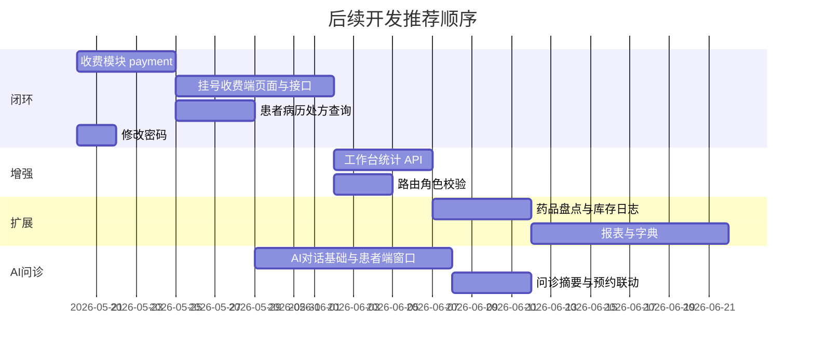
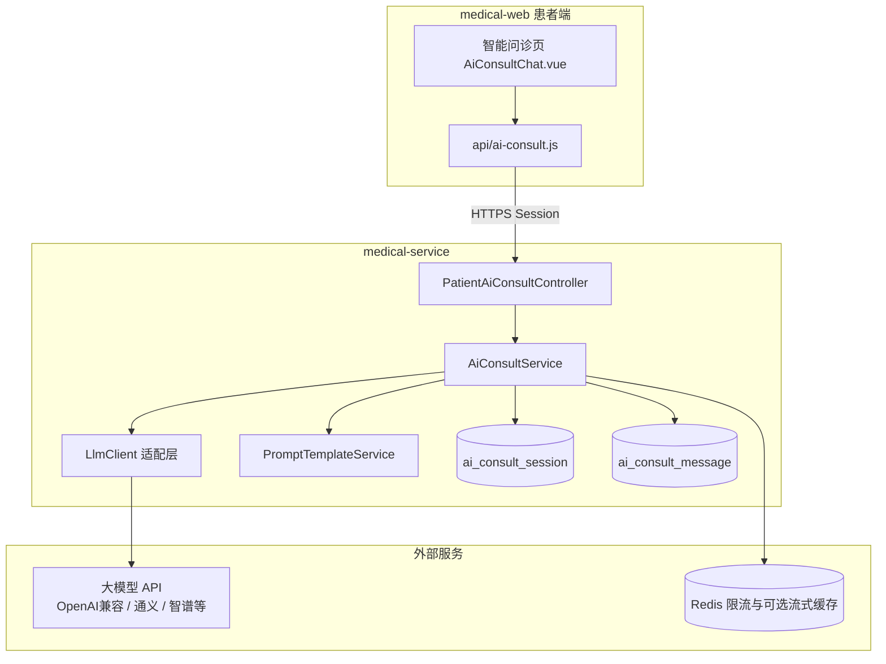
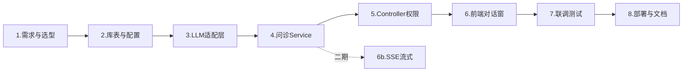

# 智能医疗服务管理系统 — 后续开发计划

> 文档版本：2026-05-19（v1.1 增补 AI 智能问诊）  
> 依据：`智能医疗服务管理系统项目文档4.25.md` + 仓库代码现状（`medical-service`、`medical-web`）  
> 用途：指导下一阶段迭代范围、优先级与验收标准

---

## 一、当前完成度总览

### 1.1 整体结论

项目已完成 **阶段一（基础框架）** 与 **阶段二（核心业务）** 的主体工作：管理端、医生端、患者端预约链路、护士发药链路均可联调。  
尚未形成完整闭环的主要是：**挂号收费端（RECEPTIONIST）**、**统一收费/退费（`payment` 表）**、**患者查阅病历/处方**、**各角色工作台数据化** 以及文档中规划的 **系统配置、统计报表** 等；**AI 智能问诊对话窗口**（接入大模型）列入 **阶段 E**，见本文档第九章。

### 1.2 模块完成度矩阵

| 端/模块 | 已落地（页面+接口） | 仅占位（`Placeholder.vue`） | 表/能力有设计未接业务 |
|---------|---------------------|------------------------------|------------------------|
| 管理端 ADMIN | 科室、医护患列表、排班、预约、药品、库存预警、用户/角色 | 修改密码 | 收费管理、系统字典、工作台真实统计 |
| 医生端 DOCTOR | 我的排班、待诊队列、病历、处方 | 工作台 | AI 建议（`ai_suggestion` 字段） |
| 患者端 PATIENT | 我要预约、我的预约（含模拟支付） | 首页、我的病历、我的处方、**智能问诊** | `payment` 流水未写入；AI 对话未开发 |
| 挂号收费 RECEPTIONIST | 仅占位接口 `ping`、`appointment/summary` | 工作台、挂号、建档、收费、退费 | 全模块 |
| 护士端 NURSE | 待发药、发药确认（含库存扣减） | 工作台、药品盘点 | 盘点/入库出库流水 |
| 基础设施 | Session 登录、RBAC、MyBatis-Plus、Knife4j | — | Redis 已依赖未使用；文档写 JWT 实为 Session |

### 1.3 代码与文档差异（需知）

| 项 | 项目文档描述 | 代码实际 |
|----|--------------|----------|
| 认证方式 | JWT + `Authorization: Bearer` | **HttpSession**（`AuthController` + `HttpSessionSecurityContextRepository`） |
| Redis | 会话、验证码、热点缓存 | `application-dev.yml` 已配置，**业务代码无 RedisTemplate/缓存调用** |
| 患者支付 | 支付预约 | 仅更新 `appointment.paid`，**未写 `payment` 表** |
| 发药库存 | 阶段三待做 | **已实现**：`PrescriptionServiceImpl.dispensePrescription` 扣减 `medicine.stock_quantity` |
| 管理端 Dashboard | 已开发页面 | 统计数字为 **前端写死 0**，无统计 API |

---

## 二、占位页面清单（优先补齐入口）

以下路由在 `medical-web/src/router/index.js` 中仍指向 `Placeholder.vue`，菜单已配置但用户点击无业务功能：

| 路由 | 角色 | 菜单标题 | 建议优先级 |
|------|------|----------|------------|
| `/reception/appointment` | RECEPTIONIST | 预约挂号 | P0 |
| `/reception/patient-register` | RECEPTIONIST | 患者建档 | P0 |
| `/reception/payment` | RECEPTIONIST | 收费 | P0 |
| `/reception/refund` | RECEPTIONIST | 退费 | P1 |
| `/reception/dashboard` | RECEPTIONIST | 工作台 | P1 |
| `/patient/medical-record` | PATIENT | 我的病历 | P1 |
| `/patient/prescription` | PATIENT | 我的处方 | P1 |
| `/user/password` | 全角色 | 修改密码 | P1 |
| `/patient/dashboard` | PATIENT | 患者首页 | P2 |
| `/doctor/dashboard` | DOCTOR | 医生工作台 | P2 |
| `/nurse/dashboard` | NURSE | 护士工作台 | P2 |
| `/nurse/inventory` | NURSE | 药品盘点 | P2 |
| `/patient/ai-consult` | PATIENT | 智能问诊（AI 对话） | **P2（阶段 E）** |

---

## 三、后续开发阶段规划

### 阶段 A：业务闭环（建议 2–3 周）— 最高优先级

目标：打通「前台挂号 → 收费 → 就诊 → 发药 → 患者查询」主路径，复用已有管理端/医生端能力，减少重复开发。

#### A1 挂号收费端（RECEPTIONIST）

**后端**（替换 `ReceptionStubController`，建议包路径 `com.medical.web.api.reception`）：

| 接口 | 方法 | 说明 | 可复用现有能力 |
|------|------|------|----------------|
| `/api/reception/appointment/page` | GET | 当日/条件预约列表 | `AppointmentService` 分页逻辑 |
| `/api/reception/appointment/create` | POST | 代患者现场挂号 | 患者端 `create` + 号源校验 |
| `/api/reception/appointment/{id}/cancel` | PUT | 取消预约 | `AdminAppointmentController` |
| `/api/reception/appointment/{id}/checkin` | PUT | 现场签到 | 管理端签到 |
| `/api/reception/patient/register` | POST | 患者建档 | `SysUserController` + `PatientExtensionService` |
| `/api/reception/patient/search` | GET | 身份证/手机号/姓名检索 | 扩展 `patient` 查询 |
| `/api/reception/payment/charge` | POST | 收费（挂号费/处方费等） | 新建 `PaymentService` |
| `/api/reception/payment/refund` | POST | 退费 | 同上，状态 2=已退款 |
| `/api/reception/payment/page` | GET | 收费流水查询 | `payment` 表 |
| `/api/reception/dashboard/summary` | GET | 工作台统计 | 聚合预约/收费 |

**前端**：

- 新建 `views/reception/`：`ReceptionDashboard.vue`、`ReceptionAppointment.vue`、`PatientRegister.vue`、`Payment.vue`、`Refund.vue`
- 新建 `api/reception.js`，从 `admin.js` 拆出挂号收费专用接口
- 预约挂号页可 **复用** `AppointmentBooking.vue`，通过 props 区分「患者自助 / 前台代挂」（患者 ID 由检索选择）

**业务规则建议**：

1. 现场挂号：必须先选/建患者 → 选科室医生排班 → 占号源 → 可选立即收费。
2. 收费成功：写 `payment` 记录，并同步更新业务单（如 `appointment.paid=1` 或处方待缴费状态）。
3. 退费：校验原支付记录、业务状态（未就诊/未发药等），写退款流水并回滚关联状态。

#### A2 统一收费模块（`payment` 表）

当前：`payment` 表已在 `v1`、`v13` 脚本中创建，**无 Entity/Mapper/Service/Controller**。

建议实现：

```
Payment (entity) → PaymentMapper → PaymentService
  ├── createPayment(bizType, bizId, amount, payMethod, operatorId)
  ├── refundPayment(paymentId, operatorId, reason)
  └── pageQuery(日期、患者、业务类型、状态)
```

| biz_type | 关联 | 触发场景 |
|----------|------|----------|
| APPOINTMENT | `appointment_id` | 挂号费支付/退费 |
| PRESCRIPTION | `prescription_id` | 处方缴费（发药前） |
| EXAM | 预留 | 检查检验（后期） |

**改造点**：

- 患者端 `PUT /api/patient/appointment/pay/{id}`：在 `AppointmentService.payAppointment` 内增加 `PaymentService.createPayment(...)`，不再仅改 `paid` 字段。
- 护士发药前：可增加「处方已缴费」校验（与收费台联动）。

#### A3 患者端 — 我的病历 / 我的处方

**后端**（`com.medical.web.api.patient`）：

| 接口 | 说明 |
|------|------|
| GET `/api/patient/medical-record/my` | 仅返回当前登录患者病历（按 `patient_id` 隔离） |
| GET `/api/patient/medical-record/{id}` | 详情（校验归属） |
| GET `/api/patient/prescription/my` | 我的处方列表 |
| GET `/api/patient/prescription/{id}` | 处方详情（含明细） |

实现要点：从 `SecurityContext` 解析 `user_id` → `patient.user_id` → `patient_id`，**禁止**通过路径参数传入他人 `patientId`。

**前端**：

- `views/patient/PatientMedicalRecordList.vue`
- `views/patient/PatientPrescriptionList.vue`
- 列表只读；详情可展示诊断、药品、发药状态。

#### A4 修改密码（全角色）

| 接口 | 说明 |
|------|------|
| PUT `/api/user/password` | 校验旧密码 + BCrypt 更新 |

前端：`views/user/ChangePassword.vue`，替换 `/user/password` 的 Placeholder。

---

### 阶段 B：体验与管理增强（建议 1–2 周）

#### B1 各角色工作台真实数据

| 端 | 建议指标 | 接口示例 |
|----|----------|----------|
| 管理端 | 今日预约、今日就诊、待发药、今日收入 | GET `/api/admin/dashboard/stats` |
| 医生端 | 今日待诊、已接诊、待写病历 | GET `/api/doctor/dashboard/stats` |
| 患者端 | 待就诊预约、待支付、近期病历 | GET `/api/patient/dashboard/stats` |
| 挂号端 | 今日挂号数、待收费、已收费金额 | GET `/api/reception/dashboard/summary`（与 A1 合并） |
| 护士端 | 待发药数量、今日已发药 | GET `/api/nurse/dashboard/stats` |

改造 `Dashboard.vue` 及各端 Placeholder 工作台：挂载时请求统计 API，替换写死的 `stats` 初始值。

#### B2 管理端收费查询（可选）

- 路由：`/admin/payment` 或挂在「预约管理」子菜单
- 接口：复用 `PaymentService.pageQuery`，权限 `ADMIN` / `SUPER_ADMIN`
- 支持按日期、患者、业务类型、支付方式导出（可选 CSV）

#### B3 路由与权限加固

当前 `router.beforeEach` 仅校验登录与 `requiresSuperAdmin`，**未按角色限制路径**（例如患者可手动访问 `/admin/dept`）。

建议：

1. 在 `menu-config.js` 或新建 `route-permissions.js` 维护「路径 → 允许角色」映射。
2. `beforeEach` 中校验 `to.path` 与 `userInfo.roles`；越权跳转至 `resolveDefaultHomePath()`。
3. 与后端 `SecurityConfig` 规则保持一致（文档 4.3 节矩阵）。

#### B4 前端工程整理

| 项 | 说明 |
|----|------|
| API 拆分 | 将患者、护士、挂号接口从 `admin.js` 拆至 `patient.js`、`nurse.js`、`reception.js` |
| 请求凭证 | `request.js` 配置 `withCredentials: true`（Session 场景必须） |
| 文档对齐 | 将项目文档中 JWT 描述改为 Session，或二期再迁移 JWT |

---

### 阶段 C：药房与库存深化（建议 1 周）

发药扣库存已在 `PrescriptionServiceImpl` 实现，本阶段补 **盘点与台账**：

| 功能 | 说明 |
|------|------|
| 药品盘点页 `/nurse/inventory` | 展示药品列表、账面库存、实盘录入、差异说明 |
| 入库/出库记录表（可选） | 新建 `medicine_stock_log`：`medicine_id`、`change_qty`、`biz_type`（DISPENSE/ADJUST/INBOUND） |
| 盘点调整 | 管理员或护士角色调用 `PUT /api/admin/medicine/{id}/stock` 或专用 adjust 接口 |
| 低库存通知 | 在现有 `stock-warning` 基础上，工作台红点或每日汇总（可选） |

---

### 阶段 D：系统能力与扩展（可选，1–2 周+）

#### D1 系统配置 / 数据字典

- 表：`sys_config` 或 `sys_dict` + `sys_dict_item`
- 配置项示例：默认号源数、预约提前天数、医院名称、挂号费默认值
- 管理端菜单：「系统管理 → 参数配置 / 字典管理」（仅 `SUPER_ADMIN`）

#### D2 统计报表

| 报表 | 维度 |
|------|------|
| 门诊量统计 | 科室、医生、日/周/月 |
| 收入统计 | 业务类型、支付方式 |
| 药品消耗 | 药品、科室、周期 |
| 预约爽约率 | 医生、时段 |

实现：MyBatis 聚合 SQL + 管理端 ECharts 图表页。

#### D3 Redis 落地

| 场景 | 说明 |
|------|------|
| 验证码 | `/api/captcha` 已在白名单，可实现图形码 + Redis 存储 |
| 热点数据 | 科室树、药品分类缓存 |
| 分布式锁（可选） | 预约占号 `schedule.booked_slots` 防超卖 |

#### D4 医生端 AI 病历建议（与阶段 E 共用 LLM 能力）

- 字段：`medical_record.ai_suggestion` 已存在
- 接口：`POST /api/doctor/medical-record/{id}/ai-suggest`（单次生成，非多轮对话）
- 前端：病历编辑页增加「AI 建议」按钮与只读展示区
- **实现上复用阶段 E 的 `LlmClient` / Prompt 模板**，与患者问诊会话分离

#### D5 认证升级（可选）

若需前后端完全分离部署且跨域无 Cookie：

- 引入 JWT（或 Spring Authorization Server）
- 刷新 Token、登出黑名单（Redis）
- 前端 `localStorage` + `Authorization` 头

当前 Session 方案在 **同域 Nginx 反代** 下可继续使用，不必为一期强行改造。

#### D6 生产部署与运维（与 AI 模块共用配置项见 9.8）

- 按项目文档 8.2 节完成 Nginx + `dist` + jar 部署清单
- `application-prod.yml`：数据源、Redis、日志级别
- 健康检查：`/actuator/health`（需引入 starter）
- SQL 迁移：Flyway/Liquibase 管理 v1–v13，避免手工漏执行

---

## 四、推荐实施顺序（迭代 backlog）



| 序号 | 任务 | 优先级 | 预估工时 | 依赖 |
|------|------|--------|----------|------|
| 1 | Payment 实体与服务 + 接入预约支付 | P0 | 2–3 天 | — |
| 2 | 挂号收费端：预约列表/代挂/签到 | P0 | 3–4 天 | 1 可选并行 |
| 3 | 挂号收费端：患者建档与检索 | P0 | 2 天 | — |
| 4 | 挂号收费端：收费/退费页 | P0 | 2–3 天 | 1 |
| 5 | 患者：我的病历、我的处方 | P1 | 2 天 | — |
| 6 | 全角色：修改密码 | P1 | 1 天 | — |
| 7 | 各端工作台统计 API + 页面 | P1 | 2–3 天 | 1、2 |
| 8 | 前端路由按角色拦截 | P1 | 1 天 | — |
| 9 | API 文件拆分与 Session 配置核对 | P2 | 1 天 | — |
| 10 | 护士药品盘点 + 库存流水 | P2 | 3–4 天 | — |
| 11 | 管理端收费流水查询 | P2 | 1–2 天 | 1 |
| 12 | 系统字典/配置 | P3 | 3–5 天 | — |
| 13 | 统计报表 + 图表 | P3 | 5–7 天 | 1 |
| 14 | Redis 验证码/缓存 | P3 | 2–3 天 | — |
| 15 | **阶段 E：AI 智能问诊（对话窗口 + 大模型接入）** | **P2** | **8–12 天** | A3 患者端基础；建议 Redis |
| 16 | 医生端 AI 病历建议（复用 LLM 层） | P3 | 2–3 天 | 15 |
| 17 | JWT 改造 / 生产部署文档落地 | P4 | 3–5 天 | — |

---

## 五、接口与文件规划（新增清单）

### 5.1 后端新增/调整

```
medical-service/src/main/java/com/medical/
├── domain/entity/Payment.java
├── mapper/PaymentMapper.java
├── service/PaymentService.java
├── service/impl/PaymentServiceImpl.java
├── web/api/
│   ├── reception/
│   │   ├── ReceptionAppointmentController.java
│   │   ├── ReceptionPatientController.java
│   │   └── ReceptionPaymentController.java
│   ├── patient/
│   │   ├── PatientMedicalRecordController.java
│   │   ├── PatientPrescriptionController.java
│   │   └── PatientAiConsultController.java   # 阶段 E
│   ├── ai/ ...                               # 阶段 E，见 9.11
│   └── UserController.java          # 修改密码、个人信息
```

### 5.2 前端 API 模块（阶段 B4 已落地）

```
medical-web/src/api/
├── admin.js       # 管理端：用户/角色/科室/药品/排班/预约/工作台
├── doctor.js      # 医生端：病历/待诊队列/处方/工作台
├── patient.js     # 患者端：排班查询/预约/病历/处方/工作台
├── nurse.js       # 护士端：发药/工作台
├── reception.js   # 挂号端：建档/预约/收费/退费/工作台
├── payment.js     # 管理端收费流水查询
├── auth.js        # 登录/登出
└── user.js        # 修改密码

medical-web/src/utils/
├── request.js           # axios 封装，withCredentials: true（HttpSession）
└── route-permissions.js # 路由角色拦截（阶段 B3）
```

**认证说明（与代码一致）：** 前端使用 **HttpSession + Cookie**，非 JWT。`request.js` 已配置 `withCredentials: true`；开发环境 Vite 代理 `/api` 至后端，生产建议 Nginx 同域反代。

```
medical-web/src/views/ …（各端页面）
```

### 5.3 数据库

| 变更 | 说明 |
|------|------|
| 复用 `payment` | 无需改表，补业务写入 |
| 可选 `v14_medicine_stock_log.sql` | 库存变动流水 |
| 可选 `v15_sys_dict.sql` | 字典与配置 |
| **`v16_ai_consult_tables.sql`** | **AI 问诊会话与消息表（阶段 E）** |

---

## 六、验收标准（阶段 A 完成即可演示）

1. **挂号员** 可检索/新建患者 → 代挂预约 → 收费 → 打印或展示流水号（`payment_no`）。
2. **患者** 登录后可查看自己的病历、处方（只读），预约支付后能在「我的预约」看到已支付且 `payment` 有记录。
3. **医生** 待诊队列、病历、处方流程与现网一致，不受挂号端改动破坏。
4. **护士** 待发药列表发药后库存减少；库存不足时发药失败提示不变。
5. **退费** 仅允许符合规则的单据退款，且 `payment.status=2`、业务单状态回滚正确。
6. 任意角色可修改自己的登录密码。
7. 患者无法通过 URL 直接打开管理端菜单（路由拦截生效）。

---

## 七、风险与注意事项

| 风险 | 缓解措施 |
|------|----------|
| 预约号源并发超卖 | 占号时对 `schedule` 行加乐观锁或 Redis 锁；事务内 `booked_slots+1` 前校验余量 |
| 支付与业务状态不一致 | 支付写 `payment` 与更新业务单同一 `@Transactional` |
| Session 跨域失效 | 生产 Nginx 同域反代 `/api`；开发环境 Vite 代理 + `withCredentials` |
| 护士发药写死 `nurseId=1` | `NursePrescriptionController.dispense` 应从登录用户解析护士 ID |
| 文档与实现不一致 | 以本计划 + 代码为准，同步修订 4.25 项目文档认证章节 |
| AI 输出被当作医疗诊断 | 固定免责声明 + System Prompt 约束 + 前端醒目提示；危急症状引导急诊 |
| 大模型密钥泄露 | **仅后端调用**；密钥放环境变量/配置中心，禁止写入前端与 Git |
| 问诊内容含敏感个人信息 | 日志脱敏；可选发送前掩码身份证/手机号；会话归属校验 |
| 接口费用与滥用 | 按用户限流（Redis）；单会话最大轮次；每日 Token 上限 |

---

## 八、与原版开发阶段对照

| 原项目文档阶段 | 状态 | 后续对应本计划 |
|----------------|------|----------------|
| 9.1 基础框架 | 基本完成 | B4 文档修正；D5/D6 可选 |
| 9.2 核心业务 | 大部分完成 | A3 患者查询；A1 挂号端 |
| 9.3 收费与完善 | **进行中** | **阶段 A**（payment + 挂号收费 + 权限） |
| 9.4 优化与扩展 | 未开始 | **阶段 C、D、E（AI 问诊）** |

---

## 九、阶段 E：AI 智能问诊对话（大模型接入）

### 9.1 功能定位与边界

| 项目 | 说明 |
|------|------|
| **产品名称** | 智能问诊助手（患者端 AI 对话窗口） |
| **主要用户** | `PATIENT`（一期）；二期可开放医生端「预问诊摘要」只读查看 |
| **核心能力** | 多轮自然语言交互，采集主诉、症状时长、伴随症状等，给出**就医建议**（是否急诊、建议科室、是否预约），**不替代**医生诊断与处方 |
| **明确不做** | 不输出确诊病名作为最终结论；不开具处方；不保证用药剂量；急重症必须引导 **120 / 急诊科** |
| **与现有系统关系** | 问诊会话独立存储；可生成「问诊摘要」供患者预约时参考或医生接诊时查看（写入 `medical_record` 扩展或关联表）；与 `ai_suggestion`（医生单次生成）共用 LLM 客户端，业务隔离 |

**合规提示文案（前端常驻 + 首条系统消息）：**

> 本服务由人工智能提供健康咨询参考，不能替代执业医师面诊。如有胸痛、呼吸困难、大出血、意识不清等紧急情况，请立即拨打 120 或前往急诊科。

---

### 9.2 总体架构



**设计原则：**

1. **前端不直连大模型**：所有模型调用经 Spring Boot 代理，统一鉴权、审计、限流。
2. **会话归属**：`session.patient_id` 必须与当前登录患者一致。
3. **一期可先同步接口**，二期再升级为 SSE 流式输出（打字机效果）。

---

### 9.3 数据库设计

脚本建议：`medical-service/src/main/resources/db/v16_ai_consult_tables.sql`

#### 9.3.1 `ai_consult_session`（问诊会话）

| 字段 | 类型 | 说明 |
|------|------|------|
| session_id | BIGINT PK | 会话 ID |
| session_no | VARCHAR(50) UNIQUE | 会话编号，如 `C202605191430xxxx` |
| patient_id | BIGINT NOT NULL | 患者 ID |
| title | VARCHAR(200) | 会话标题（首条用户消息摘要或 AI 生成） |
| status | TINYINT | 1=进行中 2=已结束 3=已转预约 |
| chief_complaint | VARCHAR(500) | 结构化主诉（问诊结束后 AI 或规则提取） |
| suggested_dept_id | BIGINT | 建议科室 ID（可对接 `sys_dept`） |
| urgency_level | VARCHAR(20) | NORMAL / URGENT / EMERGENCY |
| summary | TEXT | 问诊摘要（JSON 或 Markdown） |
| message_count | INT | 消息条数 |
| token_used | INT | 累计 Token（统计成本） |
| created_time / updated_time | DATETIME | — |
| ended_time | DATETIME | 结束时间 |

#### 9.3.2 `ai_consult_message`（会话消息）

| 字段 | 类型 | 说明 |
|------|------|------|
| message_id | BIGINT PK | 消息 ID |
| session_id | BIGINT NOT NULL | 会话 ID |
| role | VARCHAR(20) | `system` / `user` / `assistant` |
| content | TEXT NOT NULL | 消息正文 |
| content_type | VARCHAR(20) | TEXT（一期）；IMAGE 预留 |
| model_name | VARCHAR(50) | 实际调用的模型名 |
| prompt_tokens / completion_tokens | INT | 可选，计费统计 |
| created_time | DATETIME | — |

#### 9.3.3 可选扩展 `ai_consult_session_appointment`

| 字段 | 说明 |
|------|------|
| session_id + appointment_id | 问诊结束后一键预约时关联 |

索引建议：`idx_session_patient`、`idx_message_session_time`。

---

### 9.4 接口设计

前缀：`/api/patient/ai-consult/**`，权限：`hasRole("PATIENT")`（与现有 `SecurityConfig` 患者端规则一致）。

| 方法 | 路径 | 说明 |
|------|------|------|
| POST | `/session` | 创建新会话，返回 `sessionId`、`welcomeMessage` |
| GET | `/session/list` | 我的历史会话（分页） |
| GET | `/session/{sessionId}` | 会话详情 + 消息列表 |
| POST | `/session/{sessionId}/message` | 发送用户消息，返回 AI 回复（同步） |
| POST | `/session/{sessionId}/message/stream` | **二期**：SSE 流式回复 |
| PUT | `/session/{sessionId}/end` | 结束会话，触发摘要生成 |
| GET | `/session/{sessionId}/summary` | 获取结构化摘要（主诉、建议科室、就医建议） |
| DELETE | `/session/{sessionId}` | 删除会话（软删可选） |
| GET | `/dept/suggest` | 根据摘要关键词匹配科室（规则 + 可选 LLM） |

**发送消息请求体示例：**

```json
{
  "content": "我头痛三天了，伴有低烧"
}
```

**发送消息响应示例：**

```json
{
  "code": 200,
  "data": {
    "userMessageId": 101,
    "assistantMessageId": 102,
    "reply": "了解您头痛伴低烧已三天。请问疼痛主要在哪个部位？体温大概多少？",
    "urgencyHint": null
  }
}
```

---

### 9.5 大模型接入方案

#### 9.5.1 推荐接入方式

采用 **OpenAI Chat Completions 兼容协议** 的 HTTP API，便于切换厂商：

| 厂商 | 说明 | 配置项示例 |
|------|------|------------|
| 阿里云通义千问 | DashScope OpenAI 兼容模式 | `base-url` + `api-key` + `model=qwen-plus` |
| 智谱 AI | GLM OpenAI 兼容 | `model=glm-4-flash` |
| DeepSeek | 性价比高，适合课程/demo | `model=deepseek-chat` |
| OpenAI | 需网络与付费 | `model=gpt-4o-mini` |

#### 9.5.2 后端配置（`application-dev.yml` / 环境变量）

```yaml
medical:
  ai:
    enabled: true
    provider: dashscope          # dashscope | zhipu | deepseek | openai
    base-url: https://dashscope.aliyuncs.com/compatible-mode/v1
    api-key: ${AI_API_KEY:}      # 禁止提交到 Git
    model: qwen-plus
    timeout-ms: 60000
    max-context-messages: 20       # 带入模型的历史轮次上限
    max-output-tokens: 1024
    daily-request-limit-per-user: 50
```

#### 9.5.3 核心类规划

```
com.medical.ai/
├── config/AiProperties.java
├── client/LlmClient.java              # 接口
├── client/OpenAiCompatibleClient.java   # RestClient / WebClient 实现
├── dto/LlmChatRequest.java
├── dto/LlmChatResponse.java
├── prompt/PromptTemplateService.java  # 系统 Prompt、摘要 Prompt
├── service/AiConsultService.java
├── service/impl/AiConsultServiceImpl.java
└── support/ContentModerationHelper.java  # 敏感词、紧急关键词检测
```

**`LlmClient.chat(List<ChatMessage> messages)`**：组装 `messages` 数组调用 `/chat/completions`，解析 `choices[0].message.content`。

---

### 9.6 System Prompt 设计要点

系统提示词（存入 `PromptTemplateService`，版本化管理）需包含：

1. **角色**：医院线上智能问诊助手，面向患者预问诊。
2. **任务**：用简短、易懂的中文追问，收集主诉、起病时间、程度、诱因、伴随症状、既往史与过敏史（若患者愿意提供）。
3. **输出约束**：
   - 每次回复控制在 150 字以内（可配置）；
   - 禁止给出明确「您得了 XXX 病」的诊断结论；
   - 可给出「可能涉及 XX 科室」「建议尽快就医」等导向；
   - 识别急症关键词时，首句提醒急诊。
4. **科室映射**：注入本院 `sys_dept` 列表（名称 + dept_id），便于摘要里返回 `suggested_dept_id`。
5. **结束语**：会话结束时按 JSON Schema 输出摘要（主诉、建议科室、紧急程度、就医建议），由后端解析写入 `ai_consult_session.summary`。

**摘要 Prompt（结束会话时单独调用一次）：**

```
请根据以下医患对话，输出 JSON：
{"chief_complaint":"","urgency_level":"NORMAL|URGENT|EMERGENCY","suggested_dept_name":"","medical_advice":"","questions_for_doctor":[]}
```

---

### 9.7 前端：AI 对话窗口设计

#### 9.7.1 路由与菜单

| 项 | 值 |
|----|-----|
| 路由 | `/patient/ai-consult` |
| 组件 | `views/patient/AiConsultChat.vue` |
| 菜单 | 在 `patientMenuItems` 增加「智能服务 → 智能问诊」 |

#### 9.7.2 页面结构

```
┌─────────────────────────────────────────────┐
│ 智能问诊助手          [新建会话] [历史会话]   │
├─────────────────────────────────────────────┤
│ ⚠ 免责声明（折叠/常驻）                      │
├─────────────────────────────────────────────┤
│  消息区（滚动）                              │
│    [助手] 您好，请描述您的不适…              │
│    [用户] 我咳嗽两天了                       │
│    [助手] 是否有发热？痰的颜色？             │
├─────────────────────────────────────────────┤
│  快捷症状 chips（可选）：发热 头痛 咳嗽…      │
├─────────────────────────────────────────────┤
│  [输入框 multiline]              [发送]      │
│  结束问诊 | 查看摘要 | 去预约（有摘要后显示）  │
└─────────────────────────────────────────────┘
```

#### 9.7.3 组件拆分建议

| 文件 | 职责 |
|------|------|
| `AiConsultChat.vue` | 页面容器、会话切换 |
| `components/ai/ChatMessageList.vue` | 消息气泡（user/assistant 样式区分） |
| `components/ai/ChatInputBar.vue` | 输入、发送、禁用态（请求中） |
| `components/ai/ConsultDisclaimer.vue` | 免责声明 |
| `components/ai/ConsultSummaryDrawer.vue` | 结束问诊后展示摘要 |
| `api/ai-consult.js` | 封装会话与消息 API |

#### 9.7.4 交互细节

- 发送后：输入框禁用，展示 loading（助手侧「正在输入…」）。
- 同步接口：收到完整回复后追加消息并滚动到底部。
- **流式（二期）**：`EventSource` 或 `fetch` + `ReadableStream` 逐字追加 `assistant` 消息。
- 离开页面前若有进行中会话，可提示「是否结束问诊」。
- 「去预约」：携带 `suggested_dept_id` 或科室名称跳转 `/patient/appointment`（query 参数）。

---

### 9.8 详细开发流程（分步实施）

以下流程按 **8 个步骤、约 8–12 个工作日** 估算（1 人全栈；前后端可并行部分任务）。

---

#### 步骤 1：需求确认与技术选型（0.5 天）

| 产出 | 内容 |
|------|------|
| 需求清单 | 患者端多轮对话、历史会话、问诊摘要、预约引导、免责声明 |
| 模型选型 | 确定厂商账号、模型名、预算；开发/生产是否同一模型 |
| 接口形态 | 一期同步 JSON；二期 SSE |
| 评审 | 与指导老师/产品确认「非诊断」边界与演示场景 |

**检查点：** 模型 API Key 已申请；本地可 `curl` 通 `/chat/completions`。

---

#### 步骤 2：数据库与基础配置（0.5 天）

1. 编写并执行 `v16_ai_consult_tables.sql`。
2. 新增 Entity、`AiConsultSessionMapper`、`AiConsultMessageMapper`（MyBatis-Plus）。
3. 添加 `AiProperties` + `application-dev.yml` 配置项；`.gitignore` 确保 `application-local.yml` 不入库。
4. `pom.xml` 确认已有 `spring-boot-starter-web`；可选引入 `spring-boot-starter-webflux` 仅用于 WebClient 调用 LLM。

**检查点：** 表创建成功；配置类能读取 `medical.ai.*`。

---

#### 步骤 3：LLM 适配层开发（1–1.5 天）

1. 定义 `LlmClient` 接口与 `OpenAiCompatibleClient` 实现。
2. 实现请求体组装：`model`、`messages`、`max_tokens`、`temperature`（建议 0.3–0.7）。
3. 统一异常：`LlmTimeoutException`、`LlmApiException` → 全局异常处理返回友好提示。
4. 编写 **单元测试**（Mock WebServer 或 profile=test 跳过真实调用）。
5. 实现 `ContentModerationHelper`：本地急症关键词表（胸痛、昏迷、自杀等）→ 直接返回急诊模板，不调模型。

**检查点：** 单测或 main 方法能拿到模型回复；超时与 401 有明确错误信息。

---

#### 步骤 4：问诊业务服务层（2 天）

1. **`AiConsultService.createSession(patientId)`**  
   - 插入 `ai_consult_session`；写入首条 `system` 消息（Prompt）；返回欢迎语（可由模板固定或模型生成一句）。

2. **`sendMessage(sessionId, patientId, content)`**  
   - 校验会话归属与 `status=进行中`；  
   - 插入 `user` 消息；  
   - 从 DB 加载最近 N 条消息组装 `messages`；  
   - 调用 `LlmClient.chat`；  
   - 插入 `assistant` 消息；更新 `message_count`、`token_used`；  
   - 返回回复文本。

3. **`endSession(sessionId, patientId)`**  
   - 调用摘要 Prompt；解析 JSON 写入 `summary`、`chief_complaint`、`suggested_dept_id`、`urgency_level`；  
   - `status=已结束`。

4. **限流**：Redis `INCR ai:limit:{userId}:{yyyyMMdd}`，超限抛 `BusinessWarningException`。

5. **科室推荐**：`suggested_dept_name` 与 `sys_dept` 模糊匹配得到 `dept_id`。

**检查点：** Postman 完整跑通「建会话 → 多轮对话 → 结束 → 查摘要」。

---

#### 步骤 5：REST Controller 与权限（0.5 天）

1. 新建 `PatientAiConsultController`，路径挂载 `/api/patient/ai-consult`。
2. `SecurityConfig` 已覆盖 `/api/patient/**`，无需新增规则（保持 PATIENT 角色）。
3. 从登录态解析 `patientId`（复用患者预约模块解析 `user_id → patient_id` 逻辑）。
4. Knife4j 补充接口说明与示例。

**检查点：** 患者账号可访问；医生/未登录账号返回 403。

---

#### 步骤 6：前端对话窗口（2–3 天）

1. 新增 `api/ai-consult.js`、`AiConsultChat.vue` 及子组件（见 9.7）。
2. 注册路由 `/patient/ai-consult`，更新 `menu-config.js`。
3. 实现：进入页自动 `createSession` 或选择历史会话；消息列表渲染；发送与 loading；结束问诊弹窗展示摘要。
4. 「去预约」跳转带 query。
5. 样式与现有 `medical-web` 主题（Element Plus + 现有 CSS 变量）保持一致。

**检查点：** 浏览器完整演示多轮对话；刷新页面可通过 `sessionId` 拉历史消息。

---

#### 步骤 7：联调、测试与安全加固（1–1.5 天）

| 测试类型 | 用例 |
|----------|------|
| 功能 | 新建/历史/发送/结束/摘要/删除会话 |
| 权限 | 患者 A 不能访问患者 B 的 `sessionId` |
| 边界 | 空消息、超长消息（后端截断 2000 字）、会话已结束仍发送 |
| 急症 | 输入「胸痛」返回急诊引导 |
| 限流 | 超每日次数返回明确提示 |
| 异常 | 模型 Key 错误、超时、网络断开 |
| 性能 | 单轮响应时间记录；必要时调低 `max_tokens` |

**检查点：** 测试用例表全部通过；演示录屏脚本就绪。

---

#### 步骤 8：部署、运维与文档（0.5–1 天）

1. 生产环境变量：`AI_API_KEY`、`medical.ai.base-url`、`medical.ai.model`。
2. Nginx 若启用 SSE，需关闭缓冲：`proxy_buffering off`（仅流式接口 location）。
3. 日志：不打印完整对话内容至 INFO；仅 `session_id` + token 统计。
4. 回写 `智能医疗服务管理系统项目文档4.25.md`：患者端模块表、API 清单、架构图。
5. 课程/demo：提供无 Key 时的 `medical.ai.enabled=false` 降级（返回 Mock 文案）。

**检查点：** 生产或答辩环境一键启动；Key 未配置时有友好降级。

---

### 9.9 开发流程总览图



---

### 9.10 与预约、病历的联动（建议二期）

| 联动点 | 实现方式 |
|--------|----------|
| 问诊 → 预约 | 摘要中的 `suggested_dept_id` 带入 `AppointmentBooking.vue` 默认科室 |
| 问诊 → 接诊 | 医生「待诊队列」详情展示 `ai_consult_session.summary`（需患者授权或同院默认可见） |
| 问诊 → 病历 | 医生保存病历时，可选「导入预问诊摘要」填入 `chief_complaint` / `present_illness` |
| 医生 AI 建议 | `MedicalRecordList` 调用 `POST .../ai-suggest`，共用 `LlmClient`，写入 `ai_suggestion` |

---

### 9.11 文件清单汇总（阶段 E）

**后端新增：**

```
medical-service/src/main/java/com/medical/
├── ai/config/AiProperties.java
├── ai/client/LlmClient.java
├── ai/client/OpenAiCompatibleClient.java
├── ai/prompt/PromptTemplateService.java
├── ai/support/ContentModerationHelper.java
├── domain/entity/AiConsultSession.java
├── domain/entity/AiConsultMessage.java
├── mapper/AiConsultSessionMapper.java
├── mapper/AiConsultMessageMapper.java
├── service/AiConsultService.java
├── service/impl/AiConsultServiceImpl.java
└── web/api/patient/PatientAiConsultController.java
medical-service/src/main/resources/db/v16_ai_consult_tables.sql
```

**前端新增：**

```
medical-web/src/
├── api/ai-consult.js
├── views/patient/AiConsultChat.vue
└── components/ai/
    ├── ChatMessageList.vue
    ├── ChatInputBar.vue
    ├── ConsultDisclaimer.vue
    └── ConsultSummaryDrawer.vue
```

---

### 9.12 阶段 E 验收标准

1. 患者登录后打开「智能问诊」，可新建会话并进行 **至少 3 轮** 有效对话。
2. 所有模型请求经后端代理，浏览器网络面板 **看不到** API Key。
3. 结束问诊后展示结构化摘要（主诉、建议科室、就医建议）。
4. 急症关键词触发时，回复含急诊/120 引导，且不依赖模型「幻觉」。
5. 历史会话列表可查看过往对话；无法访问他人 `sessionId`。
6. （可选）摘要页可一键跳转「我要预约」且科室预填正确。
7. `medical.ai.enabled=false` 时系统可降级演示，不阻塞其他业务。

---

### 9.13 二期增强（可选 backlog）

| 功能 | 说明 |
|------|------|
| SSE 流式输出 | `message/stream`，前端打字机效果 |
| 语音输入 | Web Speech API 转文字后发送 |
| 多模态 | 上传皮损照片（需模型支持 vision） |
| RAG 知识库 | 接入医院 FAQ、科室介绍 PDF 向量检索 |
| 管理端审计 | 会话查询、Token 消耗统计、敏感词命中报表 |
| 医生端只读 | 接诊前查看患者授权的最新预问诊摘要 |

---

## 十、参考文件索引

| 类型 | 路径 |
|------|------|
| 现状说明 | `智能医疗服务管理系统项目文档4.25.md` |
| 路由与占位 | `medical-web/src/router/index.js` |
| 菜单配置 | `medical-web/src/config/menu-config.js` |
| 挂号占位接口 | `medical-service/.../reception/ReceptionStubController.java` |
| 发药扣库存 | `medical-service/.../impl/PrescriptionServiceImpl.java` |
| 预约支付（未写流水） | `medical-service/.../AppointmentService.java` |
| 安全规则 | `medical-service/.../config/SecurityConfig.java` |
| 数据库脚本 | `medical-service/src/main/resources/db/v1~v13*.sql` |
| 病历 AI 字段（医生建议复用） | `medical_record.ai_suggestion`（v1/v13 脚本） |
| AI 问诊（规划） | 本文档 **第九章**；脚本 `v16_ai_consult_tables.sql`（待建） |

---

*本文档随迭代更新；完成阶段 A 后建议将「开发状态」表回写至 `智能医疗服务管理系统项目文档4.25.md` 第五节；完成阶段 E 后补充患者端「智能问诊」模块与 API 清单。*
